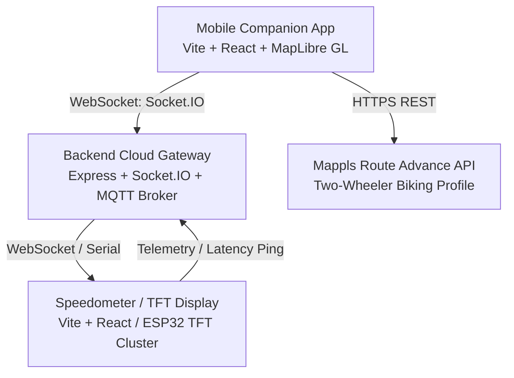

# SMART BIKE NAVIGATION SYSTEM — SOFTWARE RELEASE READINESS REPORT

**Status:** Software Release Ready  
**Automated Master Regression Suite:** 169/169 PASS (100%)  
**Physical Motorcycle Validation:** PENDING  
**Physical TFT / ESP32 Hardware Validation:** PENDING  
**Document Revision:** Step 12 Production Hardening & Release

---

## 1. Project Architecture

The Smart Bike ecosystem is structured as a decoupled, resilient three-tier distributed architecture:



- **Mobile App (`mobile-app/`)**: Primary navigation engine, GPS tracking, Mappls route calculation, turn-by-turn guidance generator, voice synthesizer, and visual navigation HUD.
- **Speedometer Cluster (`speedometer/`)**: High-contrast, motorcycle-optimized instrument cluster featuring speed, RPM, gear indicator, battery/fuel telemetry, and turn-by-turn navigation card with junction and lane assist views.
- **Backend Gateway (`backend/`)**: Real-time WebSocket (Socket.IO) gateway and MQTT message broker managing room subscriptions (`device:<id>`, `bike:<id>`), telemetry persistence, and command dispatching.
- **Bike Simulator (`bike-simulator/`)**: Hardware-in-the-loop diagnostic simulator emitting realistic vehicle telemetry (CAN/OBD, speed, lean angle, RPM) for laboratory testing.

---

## 2. Navigation Architecture

Navigation logic is implemented as a unidirectional reactive pipeline:

1. **User / TFT Destination Selection**: Resolves destination coordinates canonicalized to `{ lat, lng }`.
2. **Routing Service (`mapplsNavigationService.js` / `mapplsRoute.js`)**: Queries the official Mappls Route Advance API using the `biking` profile. Coordinates are converted to `[lng, lat]` for the wire request and normalized back to canonical `{ lat, lng }`.
3. **Navigation Engine (`mapplsNavigationEngine.js`)**: Evaluates incoming GPS points, projects the position onto route geometry using cross-track distance calculations, updates route progress monotonically, identifies current/upcoming maneuvers, calculates remaining distance/ETA, and evaluates off-route or arrival conditions.
4. **GPS Reliability Layer (`gpsReliability.js`)**: Filters out teleportation jumps (> 55 m/s motorcycle threshold), evaluates horizontal accuracy (rejecting accuracy > 100m or invalid bounds), and smooths heading jitter around the 0°/360° boundary.
5. **TFT Synchronization Bridge (`tftNavigationBridge.js`)**: Manages monotonic navigation sessions (`navigationSessionId`), monotonic sequence numbering (`sequence`), and snapshot caching. Delivers packet updates over Socket.IO to the backend and TFT cluster.
6. **Voice Navigation (`voiceNavigation.js`)**: Multi-band proximity voice alerts (APPROACH, SOON, NOW) with phoneme deduplication and speech cancellation on STOPPED.

---

## 3. Mappls Configuration

- **API Provider**: MapmyIndia / Mappls (Route Advance API & Vector Maps SDK).
- **Routing Profile**: `biking` (official two-wheeler motorized routing profile).
- **Coordinate Convention**:
  - Internal application canonical: `{ lat: number, lng: number }`
  - Mappls wire format / GeoJSON bounds: `[lng, lat]`
  - Strict conversion utilities: `toMapplsLngLat`, `fromMapplsLngLat`, `toMapplsCoordinate`, `toRouteBounds` in `mobile-app/src/utils/coordinates.js`.
- **Key Storage**: Environment variable `VITE_MAPPLS_API_KEY`.
- **Fallback**: If live Mappls network is unavailable, the system handles errors gracefully with user-friendly error banners and retry mechanisms; it **does not** generate synthetic fake routes.

---

## 4. Required Environment Variables

All secrets and credentials must be supplied via environment variables. Sample templates are provided in `.env.example` files.

### Mobile App (`mobile-app/.env.example`)
```bash
# Mappls Web Maps API Key (Mappls Console: https://auth.mappls.com/console/)
VITE_MAPPLS_API_KEY=your_mappls_api_key_here

# Smart Bike WebSocket Gateway URL
VITE_BACKEND_URL=http://localhost:5000
```

### Speedometer Cluster (`speedometer/.env.example`)
```bash
# Optional: Mappls Web Maps API Key for live TFT map background
VITE_MAPPLS_API_KEY=your_mappls_api_key_here
```

### Backend Gateway (`backend/.env.example`)
```bash
PORT=5000
MQTT_PORT=1883
MQTT_WS_PORT=8883
MONGO_URI=mongodb://localhost:27017/smart_bike
USE_MEMORY_DB=true
JWT_SECRET=your_hyper_secure_jwt_secret
JWT_EXPIRES_IN=7d
COMMAND_TIMEOUT_MS=15000
HEARTBEAT_TIMEOUT_MS=90000
CORS_ORIGIN=*
```

---

## 5. Local Development Setup

### Prerequisites
- Node.js >= 18.0.0 (Node v22 verified)
- npm >= 9.0.0

### Installation
```bash
# Install root dependencies
npm install

# Install mobile-app dependencies
cd mobile-app && npm install && cd ..

# Install speedometer dependencies
cd speedometer && npm install && cd ..

# Install backend dependencies
cd backend && npm install && cd ..
```

---

## 6. Backend Startup

To launch the real-time WebSocket and MQTT gateway:
```bash
cd backend
npm start
# Server listens on port 5000, MQTT broker on 1883/8883
```
Health check endpoint: `http://localhost:5000/health`.

---

## 7. Mobile App Startup

To start the mobile companion app in development mode:
```bash
cd mobile-app
npm run dev
# Default Vite dev server: http://localhost:5173
```

---

## 8. Speedometer Startup

To start the TFT cluster display in development mode:
```bash
cd speedometer
npm run dev
# Default Vite dev server: http://localhost:5174
```

---

## 9. TFT Connection Architecture

- **Transport**: Single persistent Socket.IO connection over WebSocket (`/socket.io`).
- **Room Subscriptions**: Client emits `join_device` with `deviceId` (e.g. `BIKE-4G-9021`).
- **Reconnection Handling**:
  - Upon reconnection, backend automatically replays the latest active navigation state (`latestNavStateByDevice[deviceId]`).
  - Speedometer also listens for `request_navigation_snapshot` and recovers on reboot.
- **Stale Packet Rejection**:
  - TFT maintains `tftActiveSessionId` and `tftLatestSequence`.
  - Packets belonging to old superseded sessions or containing out-of-order sequence numbers are rejected immediately.
  - Receipt of a `STOPPED` packet clears navigation display immediately and reverts to primary instrument gauges.

---

## 10. Navigation Lifecycle

The navigation engine enforces a strict deterministic finite state machine (FSM):

```
IDLE ──[Select Dest + Start]──> NAVIGATING
                                    │
               ┌────────────────────┼────────────────────┐
               ▼                    ▼                    ▼
           OFF_ROUTE            GPS_LOST              ARRIVED
               │                    │                    │
               ▼                    ▼                    ▼
           REROUTING          GPS_RECOVERED           STOPPED
               │                    │
               └────────► NAVIGATING ◄───────┘
```

- **Guards**:
  - Double Start / Double Route Calculation: Guarded and ignored when active.
  - Double Stop: Idempotent; preserves authoritative `STOPPED` status.
  - Stale Inflight Packets: Blocked by monotonic session tracking.
  - Impossible Transitions (e.g., `ARRIVED -> REROUTING` or `STOPPED -> NAVIGATING` from stale sequence): Strictly rejected.

---

## 11. GPS Reliability Behavior

- **Outlier Rejection**: Rejects single-frame position spikes where implied motorcycle velocity exceeds 55 m/s (~198 km/h).
- **Stationary Jitter Suppression**: At speeds below 0.8 m/s (~3 km/h), compass heading jitter (< 12°) is suppressed to prevent UI rotation shaking.
- **Boundary Handling**: Heading angular differences are normalized across the 0°/360° boundary.
- **GPS Loss & Recovery**:
  - In event of geolocation timeout (> 10s) or degraded accuracy, state transitions to `GPS_LOST`.
  - Active route geometry, steps, and destination are preserved.
  - When valid GPS fixes resume, state transitions to `GPS_RECOVERED` then immediately resumes active guidance without re-querying the network.

---

## 12. Rerouting Behavior

- **Detection**: Triggered when cross-track distance from all route segments exceeds 25 meters for 3 consecutive GPS updates.
- **Hysteresis & Backoff**: Consecutive reroute failures back off dynamically (4s, 7s, 10s, up to 12s) to prevent API spamming in urban canyons.
- **Route Atomicity**: If recalculation succeeds, the new route replaces the old route atomically with sequence progression within the same session. If recalculation fails, existing route data is retained so the rider is not left without a map.

---

## 13. Voice Guidance Behavior

- **Distance Bands**:
  - `APPROACH`: Announced at 500m (or 800m on highways).
  - `SOON`: Announced at 150m.
  - `NOW`: Announced at <= 30m.
- **Deduplication**: Announcements are tracked by `stepIndex-maneuver-band` key; identical announcements are never repeated.
- **Safety**: `cancelSpeech()` is invoked immediately when navigation is stopped or paused.
- **Graceful Degradation**: If browser Speech Synthesis API is unavailable or disabled, navigation continues silently without errors.

---

## 14. Known Limitations

1. **Browser Geolocation Precision**: In standard web browsers, GPS accuracy is limited by device hardware and operating system throttling when tabs run in the background. Native mobile wrapping (e.g. Capacitor / React Native) is recommended for production phone deployment.
2. **Tunnel / Long GPS Outage**: While route geometry is retained during GPS outages, dead-reckoning using motorcycle wheel speed sensors requires direct physical CAN/UART sensor integration with the cluster firmware.
3. **Mappls Rate Limits**: Production deployments must ensure the Mappls API tier accommodates expected daily active users (DAU) and automatic reroute volumes.

---

## 15. Physical Testing Requirements (Field Validation Checklist)

Before releasing to end consumers on physical production motorcycles:

- [ ] **Physical Motorcycle Road Test**: Mount companion phone on handlebar mount; ride actual outdoor routes through traffic, tunnels, and overpasses.
- [ ] **Physical ESP32 / TFT Hardware Validation**: Connect ESP32 TFT cluster over physical CAN bus / UART / Wi-Fi; verify sunlight readability, turn arrow contrast, and latency.
- [ ] **High-Speed Vibration Test**: Verify phone touchscreen responsiveness and GPS stabilization under engine vibration (4,000–9,000 RPM).
- [ ] **Glove Touch Usability**: Verify HUD and navigation buttons can be operated with motorcycle gloves.
- [ ] **Bluetooth Helmet Audio Intercom**: Test spoken turn-by-turn voice prompts through Sena / Cardo / generic helmet Bluetooth headsets.
- [ ] **Thermal Stress Test**: Run phone navigation continuously for 60+ minutes under direct sunlight with charger connected.

---

## 16. Production Deployment Checklist

- [ ] Ensure valid production `VITE_MAPPLS_API_KEY` is configured in production environment secrets.
- [ ] Ensure `CORS_ORIGIN` is configured to allowed production domain(s) in `backend/.env`.
- [ ] Verify `npm run build` succeeds cleanly for both `mobile-app` and `speedometer`.
- [ ] Ensure HTTPS / WSS reverse proxy (e.g., NGINX / Cloudflare) is configured with valid TLS certificates.
- [ ] Verify rate limiting and DDoS protection on backend WebSocket gateway (`backend/src/server.js`).
- [ ] Execute master automated regression test suite: `node scratch/run_all_tests.js` (169/169 tests must PASS).
- [ ] Review system logs to confirm no sensitive keys, passwords, or tokens are logged.

---

## Status Declaration

```
PHYSICAL MOTORCYCLE VALIDATION: PENDING
PHYSICAL TFT/ESP32 VALIDATION:  PENDING
SOFTWARE RELEASE READINESS:     READY
```
